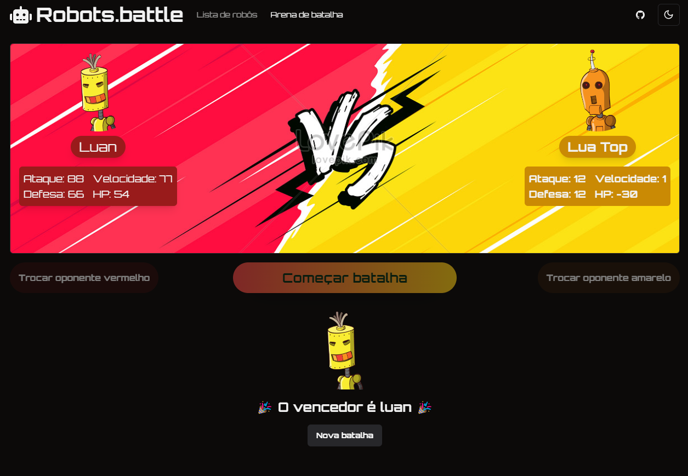

# 🤖 Robots Battle

<p align="center">
  <!-- <a href="#-layout">Layout</a> • -->
  <a href="#-technologies">Technologies</a> •
  <a href="#-getting-started">Getting started</a> •
  <a href="#-next-features">Next Features</a> •
  <a href="#-license">License</a>
</p>

<p align="center">
  
</p>

<!-- ## 🔖 Layout -->

## 🚀 Technologies and Concepts

- [Vite](vite.dev)
- [TypeScript](https://www.typescriptlang.org/)
- [Shadcn/ui](https://ui.shadcn.com)
- [React Query](https://tanstack.com/query/latest)


## 💻 Getting started

### Requirements

- [Node.js](https://nodejs.org/en/)

**Clone the project and access the folder**

```bash
git clone https://github.com/luancardosoti/robots-battle.git && cd robots-battle
```

**Follow the steps below**

```bash
# Install the dependencies
$ npm i

# Run json-server
$ npm run server

# Run project
$ npm run dev
```

## 🧑🏼‍💻 Next Features

1. Robot filtering and sorting
2. Algorithm information on the website
3. History of the latest battles
4. Tests
5. Responsiveness

## 📝 License

This project is licensed under the MIT License - see the [LICENSE](LICENSE) file for details.

---

<p align="center">
  Made